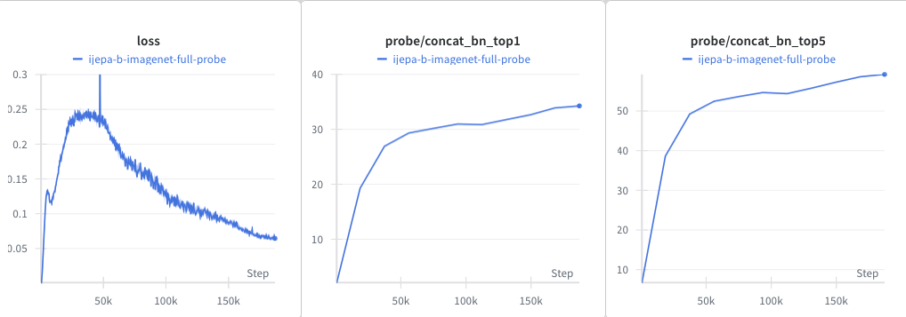

<h1 align='center'>jepax</h1>
<h2 align='center'>A JAX-based library for JEPA research</h2>
<h3 align='center'>(<a href="https://sugolov.github.io/blog/posts/20260211/">blog</a>)</h3>

jepax is a [JAX](https://github.com/google/jax)/[Equinox](https://github.com/patrick-kidger/equinox) implementation of Joint-Embedding Predictive Architecture (JEPA) models and related self-supervised learning methods. The focus is on straightforward implementations that allow for quick experimentation with new regularizers, losses, or further downstream tasks. *We are actively building this library: PRs welcome!*

### v0: features 
We focused on 1-to-1 configs, losses, and logging with the original PyTorch implementation. Below is a reproduction of IJEPA-B with data parallelization on 8xA100.



<p align='center'>Training loss and linear probe accuracy for IJEPA-B trained for 300 epochs on 8xA100 80GB.</p>

## Installation

```bash
git clone https://github.com/sugolov/jepax.git
cd jepax
pip install -e .
```

### Dataset

A straightforward way to download Imagenet1k is with HuggingFace. The below script will cache it in a target directory for your dataloader.

```bash
export HF_TOKEN=hf_xxxxxxxxxxxxx
python -m jepax.data.download_imagenet.py --data_dir ~/your/data/dir
```

### Launch IJEPA training
Launching training for any of the IJEPA-B/L/H model sizes in `configs/`:

```bash
python -m jepax.train.train_ijepa \
    --config configs/ijepa_b.yaml \
    --data_dir ~/your/data/dir \
    --save_dir ~/your/save/dir \
    --save_interval 10 \
    --exp_name ijepa-b \
    --use_wandb \
    --wandb_project ijepa 
```

## Future Development

- [ ] Reproduce ImageNet results from IJEPA
- [ ] [RCDM Visualization](https://arxiv.org/abs/2112.09164)
- [ ] Model sharding across GPUs
- [ ] Benchmarking mixed precision training ([MPX](https://arxiv.org/pdf/2507.03312))
- [ ] LeJEPA
- [ ] V-JEPA
- [ ] Update tests
- [ ] Pre-trained model weights
- [ ] Benchmarks against PyTorch implementation

## Other Resources
- [Awesome JEPA (list of JEPA papers/code)](https://github.com/lockwo/awesome-jepa)
- I-JEPA ([paper](https://arxiv.org/abs/2301.08243)) ([repo](https://github.com/facebookresearch/ijepa))
- DINOv2 ([paper](https://arxiv.org/abs/2304.07193)) ([repo](https://github.com/facebookresearch/dinov2))
- V-JEPA ([paper](https://arxiv.org/abs/2402.03406)) ([repo](https://github.com/facebookresearch/jepa))

## See Also

Other JAX libraries: [Awesome JAX](https://github.com/lockwo/awesome-jax).

## Cites

- [MPX](https://arxiv.org/pdf/2507.03312)
